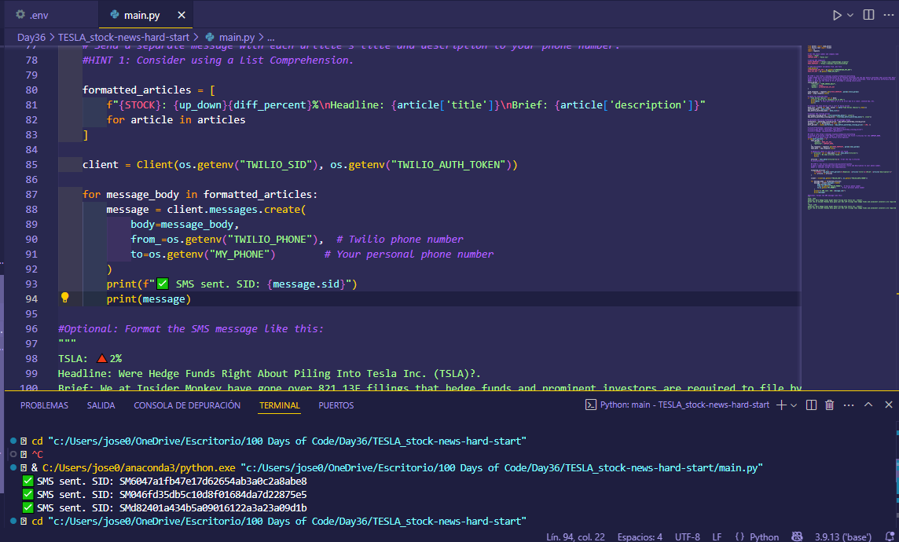
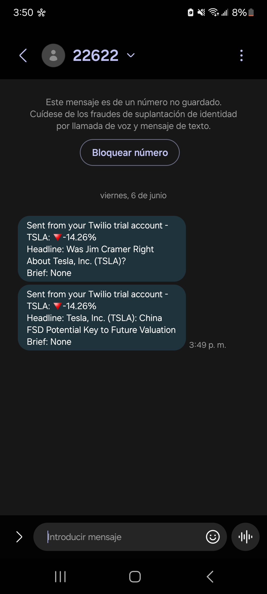

# Day 36 - Stock Trading News Alert Project (TESLA Shares)

## 📝 Description

This project is an alert system for news related to the stock price of **Tesla Inc (TSLA)**. Its purpose is to detect significant price changes (greater than 5% between yesterday and the day before) and, if such a change is detected, send a message with the latest news headlines related to the company.

The system integrates three web services:

-   📈 [Alpha Vantage](https://www.alphavantage.co/): to get daily stock price data.  
-   📰 [NewsAPI](https://newsapi.org/): to search for relevant news related to Tesla Inc.  
-   📱 [Twilio](https://www.twilio.com/en-us): to send the headlines as SMS messages directly to the user’s phone.

This project serves as a practical exercise for integrating multiple APIs, working with real-time data, and automating notifications under defined conditions.

---

## 📁 Project Structure
```bash
Day36/
├── assets/                           # Images used in the README (e.g., screenshots or demos)
├── requirements.txt                  # List of Python dependencies for both projects
├── TESLA_stock-news-hard-start/     # Project to fetch and analyze Tesla stock-related news
│   ├── main.py                       # Main logic for the Tesla stock news tracker
│   └── .env                          # Environment variables (e.g., API keys)
├── XRP_stock-news-hard-start/       # Project to fetch and analyze XRP crypto news
│   ├── main.py                       # Main logic for the XRP news tracker
│   └── .env                          # Environment variables (e.g., API keys)
└── README_Day36.md                   # Project documentation (this file)
```

---

## ⚙️ Installation

1. Clone this repository:

```bash
git clone https://github.com/Jose-Escamilla/100-days-of-code.git
```

2. Navigate to the folder for this day:
```bash
cd 100-days-of-code/Day36
```

3. (Optional) Create and activate a virtual environment:

    **🧪 Using VS Code (without Anaconda)**  
    From the VS Code terminal, run:
    ```bash
    python -m venv venv
    ```
    Then activate the virtual environment:
    - On **Windows**:
    ```bash
    .\venv\Scripts\activate
    ```
    - On **Mac/Linux**:
    ```bash
    source venv/bin/activate
    ```
    If you’re using VS Code with the Python extension installed, you’ll be able to select the interpreter at the bottom left corner. Click it and choose the new environment `./venv`.

    **🐍 Using Anaconda**  
    - Create an environment with a name, e.g., `dayX-env`:
    ```bash
    conda create -n dayX-env python=3.11
    ```
    - Activate the environment:
    ```bash
    conda activate dayX-env
    ```
    - If using VS Code, make sure to select the correct interpreter (`dayX-env`) via the command palette (`Ctrl+Shift+P` → _Python: Select Interpreter_).

4. Install dependencies:
```bash
pip install -r requirements.txt
```

---

## ▶️ How to Run

```bash
python main.py
```

Before running the script, make sure to install the required dependencies using:

```bash
pip install -r requirements.txt
```

> **Note:** This project runs in the terminal/console. It has no graphical interface. To work correctly, it also requires a `.env` file with the API keys:

```bash
ALPHAVANTAGE_API_KEY=your_alphavantage_key
NEWS_API_KEY=your_newsapi_key
TWILIO_SID=your_twilio_account_sid
TWILIO_AUTH_TOKEN=your_twilio_auth_token
TWILIO_PHONE=your_twilio_phone_number
MY_PHONE=your_personal_phone_number
```

---

## 🎥 Demo / Screenshots

Below are screenshots of the project running and the SMS message received:

<p align="center">  </p> <p align="center">  </p>

---

## 💡 Problem and Solution

### Problem:

Keeping up with relevant news that can impact the stock or crypto markets requires time and constant attention. Investors or market enthusiasts may miss important updates if they are not monitoring markets and news in real time.

### Approach and Solution:

This project solves the problem by automating the monitoring of price movements and news. Using the Alpha Vantage API, the program fetches the closing price of a stock or cryptocurrency for the last two days and calculates the percentage change. If the change exceeds a threshold (e.g., ±5%), a request is made to NewsAPI to get the 3 most recent articles about the company. Finally, each headline is sent to the user’s phone via SMS using Twilio.

The code is structured with clear and modular logic:

1. **Fetch financial data** from Alpha Vantage.  
2. **Calculate the percentage change** to decide whether to fetch news.  
3. **Query news articles** via NewsAPI.  
4. **Send automated messages** via Twilio if a significant change is detected.

---

## 🚀 Future Improvements / Limitations

- 🔄 **Use of a database or local history** to avoid sending duplicate messages on days with similar price movements.
- ⏱️ **Support for scheduled notifications**, such as daily alerts at a fixed time without manual script execution.
- 📊 **Graphical visualization** of trends or percentage changes via a web or desktop UI.
- 🌍 **Support for multiple stocks or cryptocurrencies** in a single execution.
- 📉 **Better handling of API usage limits**, especially Alpha Vantage’s strict free-tier limit of 25 calls per day.
- 📵 **Option for alternative notifications** like email or Telegram in addition to SMS.
- ❌ **No current handling for internet disconnections or service failures** (Twilio/NewsAPI); retry logic or detailed logging could be added.

---

## 🧠 Thought Process

While developing this project, my main focus was integrating several APIs to fetch stock data, pull relevant news, and send SMS alerts. I initially faced challenges handling API responses, especially due to quota limits and data formatting.

To overcome these issues, I implemented strong validation to check for the expected keys in responses and handle errors gracefully, like quota exceedance or empty results. I also learned the importance of thoroughly reading API documentation to understand limitations and parameters.

This project taught me to structure code in clear steps (get data, analyze changes, find news, send alerts) and handle exceptions for robustness. I’ll continue applying this modular and validated approach in future projects to ensure reliability.

---

## 📬 Contact

**Author:** José Escamilla  
**Email:**  
**Phone:**
