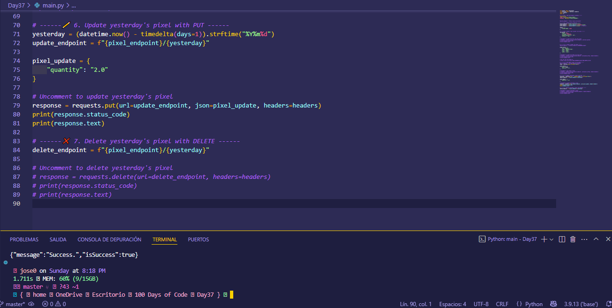
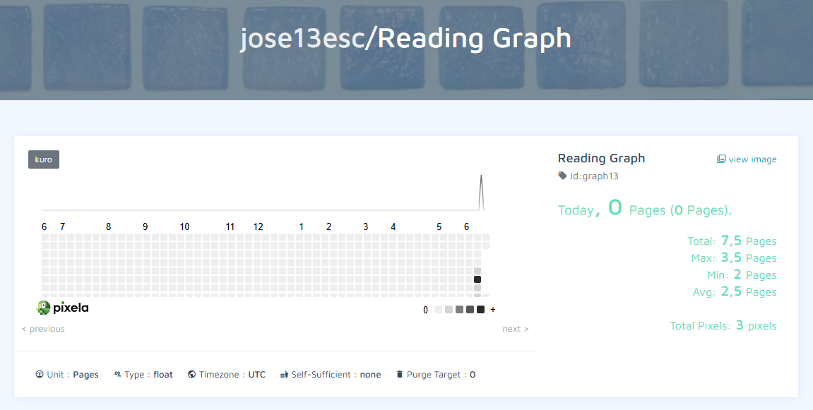

# Day 37 - Habit Tracking Project: API Post Requests & Headers

## 📝 Description

This project is a habit tracking system using the [**Pixela**](https://pixe.la/) API. Its purpose is to allow the creation of a user, set up a custom graph to log daily activities (such as pages read), and add data points (pixels) that show progress over time.

The system uses the Pixela API to perform key operations:

-   📊 Create a user and custom graphs.
-   📝 Log daily habits via POST requests.
-   ✏️ Update existing data using PUT requests.
-   🗑️ Delete data via DELETE requests.

This project is a great hands-on exercise to learn how to consume real-world APIs, manage authentication with headers, automate date handling, and perform HTTP requests (POST, PUT, DELETE) using Python.

You can consult Pixela’s official documentation here: [https://docs.pixe.la/](https://docs.pixe.la/)

---

## 📁 Project Structure
```bash
Day37/
├── assets/           # Images used in the README (screenshots, demos, etc.)
├── .env              # Environment variables (API keys, sensitive settings)
├── main.py           # Main file with project logic
├── README_Day37.md   # Project explanation
└── requirements.txt  # List of dependencies to run the project
```

---

## ⚙️ Installation

1. Clone this repository:

```bash
git clone https://github.com/Jose-Escamilla/100-days-of-code.git
```

2. Navigate to this day’s folder:
```bash
cd 100-days-of-code/Day37
```

3. (Optional) Create and activate a virtual environment:

    **🧪 Using VS Code (without Anaconda)**  
    From the VS Code terminal, run:
    ```bash
    python -m venv venv
    ```
    Then activate the virtual environment:
    - On **Windows**:
    ```bash
    .\venv\Scripts\activate
    ```
    - On **Mac/Linux**:
    ```bash
    source venv/bin/activate
    ```
    If you’re using VS Code with the Python extension installed, you can select the interpreter in the lower-left corner. Click and choose the new `./venv` environment.

    **🐍 Using Anaconda**  
    - Create the environment, e.g., `dayX-env`:
    ```bash
    conda create -n dayX-env python=3.11
    ```
    - Activate the environment:
    ```bash
    conda activate dayX-env
    ```
    - In VS Code, ensure the correct interpreter (`dayX-env`) is selected using the command palette (`Ctrl+Shift+P` → _Python: Select Interpreter_).

4. Install dependencies (if any):
```bash
pip install -r requirements.txt
```

---

## ▶️ How to Run
```bash
python main.py
```

Before running the file, make sure the necessary dependencies are installed:

```bash
pip install -r requirements.txt
```

> **Note:** This project runs in the terminal/console. It has no graphical interface. It also requires a `.env` file with API credentials:
```bash
PIXELA_TOKEN=your_pixela_token
PIXELA_USERNAME=your_pixela_username
```

To view your habit tracking system, navigate to the following URL in your browser, replacing `YOUR_USERNAME` and `YOUR_GRAPH_ID` with your info:
```bash
https://pixe.la/v1/users/YOUR_USERNAME/graphs/YOUR_GRAPH_ID.html
```

---

## 🎥 Demo / Screenshots

Below are screenshots of the project running in VS Code and the habit graph as seen on Pixela’s website:

<p align="center">
  
</p>

<p align="center">
  
</p>

---

## 💡 Problem and Solution

### The problem:

Keeping a consistent daily habit log (like reading, exercising, or studying) can be tedious and unsustainable if done manually in a notebook or spreadsheet. This can lead to lack of motivation or consistency in personal goals.

### Approach and solution:

This project automates habit tracking using the Pixela API, which provides a visual representation of daily progress via web graphs. From a Python script, users can create an account, generate a custom graph, and log new daily data (pixels) automatically or manually.

The approach follows a clear and structured process:

1. **Create a user account** via a POST request to the Pixela API.
2. **Generate the habit graph**, setting parameters like habit name, unit, and color.
3. **Log daily activity** (pixel), specifying the amount and date.
4. **Update or delete previous records** using PUT or DELETE requests when needed.

This solution simplifies habit tracking, promotes consistency, and provides a clear online visualization of progress.

---

## 🚀 Future Improvements / Limitations

- 🔄 Automate daily habit logging with scheduled tasks (e.g., using `cron` or `schedule`) to avoid manual input.
- 🧠 Add a friendly GUI allowing users to select habit, quantity, and date from a visual interface.
- 📦 More robust error and response handling (e.g., auto-retry on 503 errors).
- 🔐 Encrypt the `.env` file or use a more secure system for handling credentials (like cloud environment variables).
- 🌍 Support logging multiple habits and graphs in a single script run.
- 📊 Export habit history to a CSV or display additional statistics (weekly average, monthly progress, etc.).

> These improvements could make this project a more complete tool for personal or group habit tracking.

---

## 🧠 Thought Process

While developing this project, my main goal was to understand how to interact with external APIs using Python. I relied on both Pixela’s official documentation and Angela Yu’s detailed course explanations, which guided me step-by-step to correctly implement `POST`, `PUT`, and `DELETE` methods as well as custom headers for authenticated requests.

I focused on maintaining a clear structure, dividing the code into logical sections with descriptive comments. I also learned to use environment variables via `dotenv` to protect my credentials and practiced sending dynamic data like the current or previous date using `datetime`.

Initially, I encountered some issues with URL construction and data validation, but I resolved them by carefully reading the documentation and inspecting API responses.

This project strengthened my understanding of automating tasks with Python scripts, working with real-time data, and applying good security and code organization practices. In the future, I plan to expand projects like this by adding graphical interfaces and cloud connectivity.

---

## 📬 Contact

**Author:** José Escamilla  
**Email:**  
**Phone:**