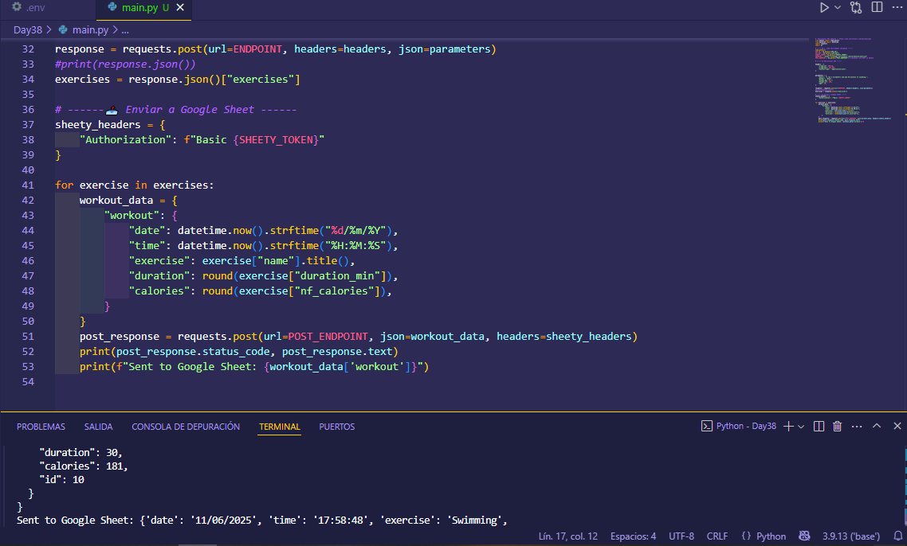
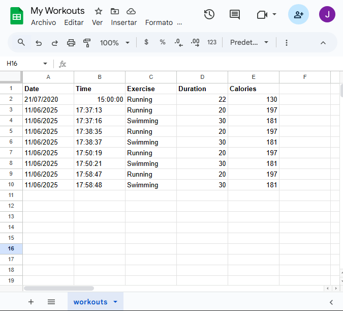

# Day 38 - Google Sheets Workout Tracker App

## 📝 Description

This project is a workout tracking app that automatically logs your workouts to a Google Sheets spreadsheet. It uses the [Nutritionix API](https://www.nutritionix.com/business/api) to interpret natural language (e.g., "I ran 3 kilometers and swam for 20 minutes") and calculate the time, calories burned, and type of exercise performed. It then sends this data to Google Sheets via [Sheety](https://sheety.co/).

This is useful because it eliminates the need for manual record-keeping, automating the daily workout logging process. It also keeps a cloud-based history accessible from any device.

Technologies and concepts applied:
- Consuming REST APIs with authentication (Bearer Token)
- Using environment variables for security
- Task automation with Python
- Integration with Google Sheets

---

## 📁 Project Structure
```bash
Day38/
├── assets/           # images or gifs if used
├── .env              # Environment variables (API keys, tokens)
├── main.py           # Main program code
├── My Workouts.xlsx  # Local copy of the spreadsheet
├── README_Day38.md   # Project description document
└── requirements.txt  # if applicable
```

---

## ⚙️ Installation

1. Clone this repository or download just this folder:

```bash
Download this folder:
git clone https://github.com/Jose-Escamilla/100-days-of-code.git
```

2. Navigate to this day’s folder:
```bash
cd 100-days-of-code/Day38
```

3. (Optional) Create and activate a virtual environment:

    **🧪 Using VS Code (without Anaconda)**  
    From the VS Code terminal, run:
    ```bash
    python -m venv venv
    ```
    Then activate the virtual environment:
    - On **Windows**:
    ```bash
    .\venv\Scripts\activate
    ```
    - On **Mac/Linux**:
    ```bash
    source venv/bin/activate
    ```
    If using VS Code and the Python extension is installed, you’ll be able to select the environment in the bottom left corner. Click and choose the new `./venv`.

    **🐍 Using Anaconda**  
    - Create the environment, e.g., `dayX-env`:
    ```bash
    conda create -n dayX-env python=3.11
    ```
    - Activate the environment:
    ```bash
    conda activate dayX-env
    ```
    - In VS Code, make sure to select the correct interpreter (`dayX-env`) from the command palette (`Ctrl+Shift+P` → _Python: Select Interpreter_).

4. Install dependencies if needed:
```bash
pip install -r requirements.txt
```

---

## ▶️ How to Run

```bash
python main.py
```

Before running the file, make sure to install the required dependencies:

```bash
pip install -r requirements.txt
```

> **Note:** This project runs in the terminal/console. It has no graphical interface. To work correctly, it also requires a `.env` file with the API keys:
```bash
APP_ID=your_nutritionix_app_id
API_KEY=your_nutritionix_api_key
POST_ENDPOINT=https://api.sheety.co/xxxxx/myWorkouts/workouts
SHEETY_TOKEN=your_sheety_bearer_token
```

---

## 🎥 Demo / Screenshots

The following screenshots illustrate how the project works:

### 💻 Code Execution in Terminal
<p align="center">
  
</p>

### 📊 Logging in Google Sheets
<p align="center">
  
</p>

---

## 💡 Problem and Solution

### Problem:

Manually recording workouts, along with duration and calories burned, can be tedious and imprecise. A more automated way was needed to interpret physical activities from natural language and log them in a structured spreadsheet.

### Approach and Solution:

The [Nutritionix API](https://www.nutritionix.com/business/api) was used to interpret free-form exercise descriptions (e.g., “I ran 3 kilometers”) and extract data like exercise type, duration, and calories. Then, using [Sheety](https://sheety.co/), the data was automatically saved to a Google Sheets spreadsheet.

The project was structured around:

- Using environment variables to protect sensitive credentials.
- Data extraction and processing logic using `requests` and `datetime`.
- A `for` loop to log multiple exercises returned by the API.
- Security via Bearer Token authentication in Sheety.

This approach makes workout tracking fast, automated, and accessible from any device.

---

## 🚀 Future Improvements / Limitations

- 🔐 **Better security**: Implement secure token storage using tools like `keyring` or `vault`, especially for cloud deployments.
- 🌐 **Web or mobile interface**: Create a graphical interface (web or app) to input exercises without relying on the terminal.
- 📝 **Multilanguage support**: Allow input in languages other than English.
- 📈 **Progress visualization**: Integrate analytics or graphs to track physical performance over time.
- ⚠️ **Network/API error handling**: Add robust error handling for failures in Nutritionix or Sheety calls.
- 🔁 **Automated execution**: Use a bot or scheduler to automate daily exercise logging via Telegram or other methods.

This project fulfills its current purpose but has great potential to expand in functionality and user experience. 🚴‍♂️📊

---

## 🧠 Thought Process

During the development of this project, I broke the problem down into clear steps, following the approach from the course:

1. 🧾 **Capturing user input**: I used natural language to describe exercises, making the experience more intuitive.
2. 📤 **Interacting with Nutritionix**: I learned how to work with external APIs by sending POST requests with headers and JSON, and how to interpret their responses.
3. 📊 **Sending to Google Sheets with Sheety**: It was interesting to see how to turn an API response into a new spreadsheet record using another API.
4. 🔐 **Authentication**: I learned about Bearer Tokens and how to protect API endpoints even in simple projects.
5. 🔧 **Environment variables**: I made sure not to expose sensitive data by separating credentials and settings from the source code.

👨‍💻 I encountered errors such as undefined variables, incorrect headers, and 401 responses. I learned to carefully read API documentation and validate each step using `print()` and testing.

🎯 This project strengthened my knowledge of HTTP requests, basic security, and development best practices. I plan to apply this modular and secure structure in future projects involving APIs or dynamic data collection.

---

## 📬 Contact

**Author:** José Escamilla  
**Email:**  
**Phone:**