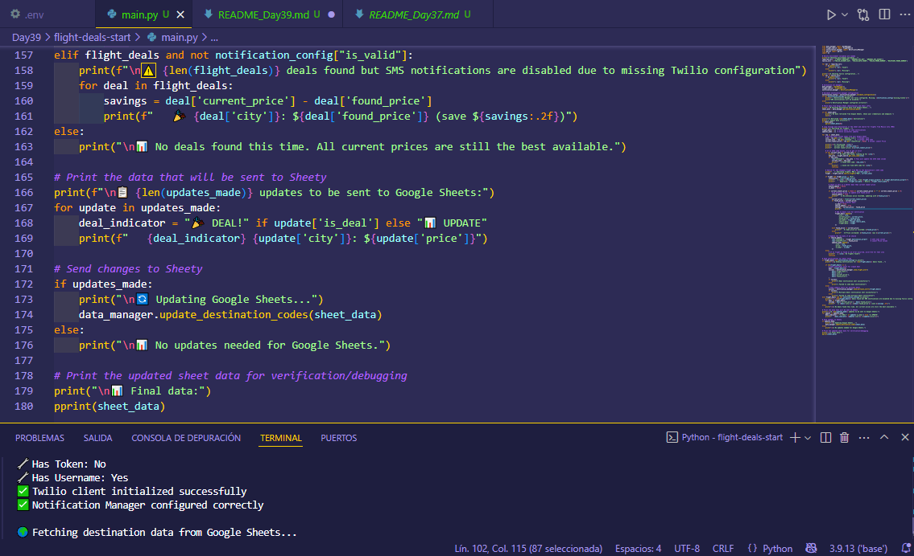
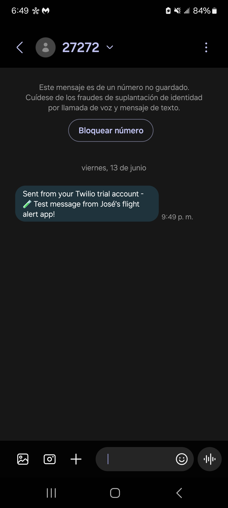

# Day 39 - Flight Deal Finder: Part 1

## 📝 Description

This project is an application that searches for cheap flights from a departure city to various destinations stored in a [Google Sheets spreadsheet](https://sheety.co/). It uses the [Amadeus Flight Offers Search API](https://developers.amadeus.com/) to query flight prices and the [Twilio Messaging API](https://www.twilio.com/docs/messaging/quickstart/python) to send SMS alerts when a better deal than the recorded minimum price is found.

It relies on key Amadeus resources, including:
- The [Flight Offers Search API documentation](https://developers.amadeus.com/self-service/category/flights/api-doc/flight-offers-search/api-reference)
- The [guide to working with API keys and tokens](https://developers.amadeus.com/get-started/get-started-with-self-service-apis-335)
- The [API for looking up airport codes by city name](https://developers.amadeus.com/self-service/category/destination-experiences/api-doc/city-search/api-reference)

This project is useful for automating the search for cheap flights and receiving real-time alerts without manual intervention.

---

## 📁 Project Structure
```bash
Day39/
├── assets/                     # Project assets (images, data, configs)
├── flight-deals-start          # Base code provided as a starting point
│   ├── .env                    # Environment variables (API credentials, Twilio settings)
│   ├── data_manager.py         # Manages data from/to Google Sheets via Sheety
│   ├── flight_data.py          # Class to store details of each found flight
│   ├── flight_search.py        # Connects to Amadeus API to search for flights
│   ├── main.py                 # Main file integrating project logic
│   └── notification_manager.py # Sends SMS alerts using Twilio
├── README_Day39.md             # This README file
├── Flight Deals.xlsx           # Spreadsheet backup with destination and price data
└── requirements.txt            # Project dependencies (if applicable)
```

---

## ⚙️ Installation

1. Clone this repository or download just this folder:

```bash
Download this folder:
git clone https://github.com/Jose-Escamilla/100-days-of-code.git
```

2. Navigate to this day’s folder:
```bash
cd 100-days-of-code/Day39
```

3. (Optional) Create and activate a virtual environment:

    **🧪 Using VS Code (without Anaconda)**  
    From the VS Code terminal, run:
    ```bash
    python -m venv venv
    ```
    Then activate the virtual environment:
    - On **Windows**:
    ```bash
    .\venv\Scripts\activate
    ```
    - On **Mac/Linux**:
    ```bash
    source venv/bin/activate
    ```
    If using VS Code and the Python extension is installed, you can select the new `./venv` interpreter from the bottom-left corner.

    **🐍 Using Anaconda**  
    - Create the environment, e.g., `dayX-env`:
    ```bash
    conda create -n dayX-env python=3.11
    ```
    - Activate the environment:
    ```bash
    conda activate dayX-env
    ```
    - In VS Code, select the correct interpreter (`dayX-env`) from the command palette (`Ctrl+Shift+P` → _Python: Select Interpreter_).

4. Install the dependencies:
```bash
pip install -r requirements.txt
```

---

## ▶️ How to Run
```bash
python main.py
```

Before running the script, make sure to install the required dependencies:

```bash
pip install -r requirements.txt
```

> **Note:** This project runs in the terminal/console. It does not have a GUI. It requires a `.env` file with API credentials:
```bash
# Amadeus
AMADEUS_API_KEY=your_api_key
AMADEUS_API_SECRET=your_api_secret

# Sheety
SHEETY_ENDPOINT=https://api.sheety.co/your_user/your_project/sheet
SHEETY_TOKEN=your_sheety_token
SHEETY_USERNAME=your_created_user
SHEETY_PASSWORD=your_created_password

# Twilio
TWILIO_ACCOUNT_SID=your_twilio_sid
TWILIO_AUTH_TOKEN=your_twilio_token
TWILIO_FROM_NUMBER=your_twilio_number
TWILIO_TO_NUMBER=your_personal_number
```

---

## 🎥 Demo / Screenshots

Below are screenshots showing the project running in VS Code and a sample SMS alert received via Twilio:

<p align="center">
  
</p>

<p align="center">
  
</p>

> 📝 Note: The SMS screenshot shows a **test message** due to Sheety’s API call limit being reached. The alert system itself works correctly.

---

## 💡 Problem and Solution

### Problem:

Manually searching for cheap flights requires time, multiple tools, and constant price monitoring. Most people don't have the time to track fares daily or know when it's best to buy. This project aims to solve that problem by automating flight deal searches and notifications.

### Approach and Solution:

The solution consists of building a system that:

- Reads a spreadsheet hosted on Google Sheets (via [Sheety](https://sheety.co/)), storing destinations and lowest recorded prices.
- Automatically retrieves IATA codes using Amadeus's [city search API](https://developers.amadeus.com/self-service/category/destination-experiences/api-doc/city-search/api-reference) if missing.
- Searches for flight deals from Mexico City (MEX) to those destinations using the [Amadeus Flight Offers Search API](https://developers.amadeus.com/self-service/category/flights/api-doc/flight-offers-search/api-reference).
- Compares the found price with the lowest stored in the sheet.
- If a better deal is found, it updates the spreadsheet automatically.
- Sends an SMS alert to the user using [Twilio](https://www.twilio.com/docs/messaging/quickstart/python) if the new price represents significant savings.

The system is structured into classes following Angela Yu’s course, splitting logic into `data_manager.py`, `flight_search.py`, `flight_data.py`, and `notification_manager.py`, ensuring clean, modular, and reusable code.

During development, the `pprint` module was used to clearly visualize API responses, greatly aiding in debugging and testing.

---

## 🚀 Future Improvements / Limitations

- 💬 **User Interface**: Add a GUI or web app to manage destinations and view deals more intuitively.
- 🕒 **Scheduled Execution**: Deploy the script to the cloud (e.g., Replit, PythonAnywhere, or server cron jobs) for daily automatic runs.
- 🔔 **Alternative Notification Channels**: Add options for email, Telegram, or WhatsApp alerts.
- 🌍 **Flexible Origin**: Allow users to specify multiple departure airports beyond "MEX".
- 🔎 **Additional Search Parameters**: Support filters like stopovers, preferred airlines, or max trip duration.
- 📉 **Price History**: Track price trends and show historical data.
- ⚠️ **API Usage Limits**: Consider limited call quotas on Sheety and Amadeus free plans.
- 🔐 **Credential Security**: Secure the `.env` file and prevent accidental uploads to the repository.

---

## 🧠 Thought Process

While developing this project, I focused on understanding how to interact with multiple external APIs (Sheety, Amadeus, and Twilio) and how to structure clean, scalable code using object-oriented programming, following the course guidelines.

One of the main challenges was handling API credentials and tokens securely. I used environment variables and the `dotenv` library to load them safely.

I also struggled with reading complex JSON responses from the APIs, so I implemented `pprint` to display the data clearly, which made debugging and comprehension easier.

To enhance maintainability and clarity, I divided functionality into specialized classes (DataManager, FlightSearch, NotificationManager), making the code modular and easier to expand or modify in the future.

I learned the importance of handling exceptions and validating configuration (e.g., Twilio setup) to avoid runtime errors.

In future projects, I plan to apply these best practices—modular design, secure environment handling, and clear debugging techniques—especially when working with external API integrations.

---

## 📬 Contact

**Author:** José Escamilla  
**Email:**  
**Phone:**